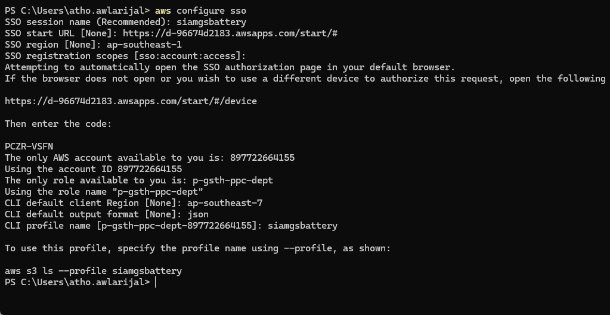
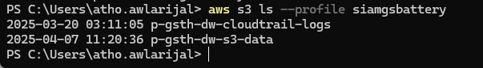
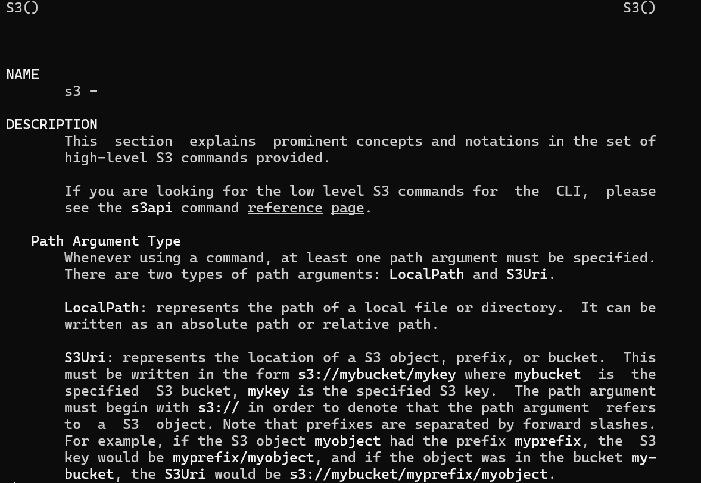

# AWS Command Line Interface (CLI)

The AWS Command Line Interface (AWS CLI) is an open-source tool that allows interaction with AWS services through commands in a command-line shell. With minimal configuration, the AWS CLI facilitates executing commands that provide functionality like that of the browser-based AWS Management Console, directly from the command prompt in a terminal program. The AWS CLI version 2 is the most recent major version of the AWS CLI and supports all the latest features.

## 2.1. Install AWS CLIv2

### 2.1.1. Linux

**Requirements:**
- Must be able to extract or "unzip" the downloaded package.
- The AWS CLI uses glibc, groff, and less. These are included by default in most major distributions of Linux.
- Support the AWS CLI on 64-bit versions of recent distributions of CentOS, Fedora, Ubuntu, Amazon Linux 1, Amazon Linux 2, Amazon Linux 2023, and Linux ARM

**To install the AWS CLI version 2 on Linux:**

1. Download and install AWS CLI v2 x64 bit, run this command:
   ```bash
   curl "https://awscli.amazonaws.com/awscli-exe-linux-x86_64.zip" -o "awscliv2.zip"
   unzip awscliv2.zip
   sudo ./aws/install
   ```

2. Confirm the installation with the following command:
   ```bash
   aws --version
   ```

### 2.1.2. Windows

**Requirements:**
- Support the AWS CLI on Microsoft-supported versions of 64-bit Windows.
- Admin rights to install software

**To install the AWS CLI version 2 on Windows:**

1. Download and run AWS CLI v2 MSI installer for Windows:
   - https://awscli.amazonaws.com/AWSCLIV2.msi

2. To confirm the installation, open the Start menu, search for cmd or PowerShell, run this command:
   ```bash
   aws --version
   ```

### 2.1.3. MacOS

**Requirements:**
- Support the AWS CLI on macOS versions 10.15 and later.
- Because AWS doesn't maintain third-party repositories, AWS can't guarantee that they contain the latest version of the AWS CLI

**To install AWS CLIv2:**

1. Open web browser and download the macOS pkg file: https://awscli.amazonaws.com/AWSCLIV2.pkg

2. Run the downloaded file and follow the on-screen instructions. You can choose to install the AWS CLI in the following ways:

   **For all users on the computer (requires sudo):**
   - You can install to any folder, or choose the recommended default folder of `/usr/local/aws-cli`.
   - The installer automatically creates a symlink at `/usr/local/bin/aws` that links to the main program in the installation folder you chose.

   **For only the current user (doesn't require sudo):**
   - You can install to any folder to which you have write permission.
   - Due to standard user permissions, after the installer finishes, you must manually create a symlink file in your `$PATH` that points to the `aws` and `aws_completer` programs by using the following commands at the command prompt. If your `$PATH` includes a folder you can write to, you can run the following command without sudo if you specify that folder as the target's path. If you don't have a writable folder in your `$PATH`, you must use sudo in the commands to get permissions to write to the specified target folder. The default location for a symlink is `/usr/local/bin/`.

   ```bash
   sudo ln -s /folder/installed/aws-cli/aws /usr/local/bin/aws
   sudo ln -s /folder/installed/aws-cli/aws_completer /usr/local/bin/aws_completer
   ```

If you have any issues during the installation, please follow this FAQ: https://docs.aws.amazon.com/cli/latest/userguide/cli-chap-troubleshooting.html

For more information about installing AWS CLI: https://docs.aws.amazon.com/cli/latest/userguide/getting-started-install.html#getting-started-install-instructions

## 2.2. Configure AWS CLI

To access AWS Management using the AWS CLI, the previously created access key and secret key can be used.

1. Open terminal, run this command:
   ```bash
   aws configure sso
   ```

   

2. Fill with these values:
   - **SSO session name (Recommended):** siamgsbattery
   - **SSO start URL [None]:** https://d-96674d2183.awsapps.com/start/#
   - **SSO region [None]:** ap-southeast-1
   - **SSO registration scopes [sso:account:access]:** just press enter

   Will open the browser then login using SSO IAM Identity center. After successfully login fill the value below:
   - **CLI default client Region [None]:** ap-southeast-7
   - **CLI default output format [None]:** json
   - **CLI profile name [897722664155_p-gsth-ppc-dept]:** profilename

   > **Note:** profilename will use to identify aws account if there are multiple aws accounts.

3. After configuring with the access key and secret key, verify by using an AWS CLI command that users have permission.

   For example, user that has access to S3:
   ```bash
   aws s3 ls --profile profilename
   ```
   Will return list S3 buckets

   

**Tips:** You can use help command for detail of command:
```bash
aws help
aws <command> help
aws <command> <subcommand> help
```

For example, detail s3 command:
```bash
aws s3 help
```



Use arrow up and down to scroll, for exit press `q`.

For more information AWS Command Line Interface (CLI) v2 command: https://awscli.amazonaws.com/v2/documentation/api/latest/index.html
