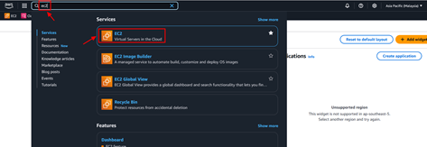
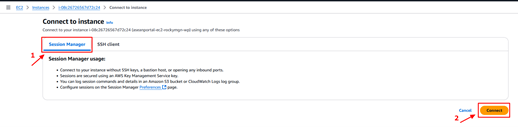
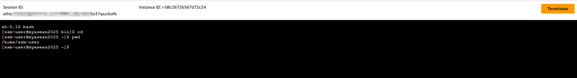

# Access EC2 Instance

## 3.1. Access Remotely via System Manager Session Manager

In a case where any instances are not accessible from internet or VPN, the alternative is to connect to the instance using System Manager Session Manager.

### 1. Install session manager plugin for AWS

https://docs.aws.amazon.com/systems-manager/latest/userguide/session-manager-working-with-install-plugin.html

### 2. Connect to the instance

The requirements are:
- **AWS CLI Configured** with permission to do ssm.
- **The instance must be able to access SSM endpoint** via internet or VPC endpoint.
- **The instance must have permission to get message from SSM**. The easiest way to do it is by attaching the AWS managed policy `AmazonSSMManagedInstanceCore` to the instance's IAM role.

```bash
aws ssm start-session --target <InstanceID> --profile <profilename>
```

**Example:**
```bash
aws ssm start-session --target "i-061da0d3edbe1c747" --profile <profilename>
```

### 3. Port forward to access open port in the instance

The concept is like SSH tunnel, where we forward traffic between our workstation to open port in the target instance. For example, the instance has HTTP server running on port 80. With SSM port-forward, we can access that web server via localhost.

```bash
aws ssm start-session --target <InstanceID> --document-name "AWS-StartPortForwardingSession" --parameters portNumber="<serverPort>",localPortNumber="<localPort>" --profile <profilename>
```

**Example:**
```bash
aws ssm start-session --target "i-061da0d3edbe1c747" --document-name "AWS-StartPortForwardingSession" --parameters portNumber="80",localPortNumber="8080" --profile <profilename>
```

### 4. Extending the previous port-forward

We can also access the open port in other instances. For example: RDS database for MariaDB or Amazon MQ for RabbitMQ. The requirement is the instance should have network connectivity (allowed via NACL and/or Security Group) to the remote ports.

```bash
aws ssm start-session --target <InstanceID> --document-name "AWS-StartPortForwardingSessionToRemoteHost" --parameters host="<RemoteHostIPOrDomain>",portNumber="<RemotePort>",localPortNumber="<LocalPort>" --profile <profilename>
```

**Example:**
```bash
aws ssm start-session --target "i-061da0d3edbe1c747" --document-name "AWS-StartPortForwardingSessionToRemoteHost" --parameters host="b-725ead4b-8f03-4e90-99ec-10af5322317d.mq.ap-southeast-3.amazonaws.com",portNumber="443",localPortNumber="6443" --profile <profilename>
```

## 3.2. Access via AWS Management Console

**Requirements:**
- **User has access to EC2 management console.**
- **The instance must be able to access SSM endpoint** via internet or VPC endpoint.
- **The instance must have permission to get message from SSM**. The easiest way to do it is by attaching the AWS managed policy `AmazonSSMManagedInstanceCore` to the instance's IAM role.

**Follow these steps:**

### 1. Login to AWS Management Console

Go to EC2 by search EC2 in search bar.



### 2. Select and Connect to Instance

Click Instances, select EC2 that want to connect, click the Connect button.

### 3. Use Session Manager

Click on Session Manager then click the Connect button.



### 4. Browser Session

It will open new tab on browser.



