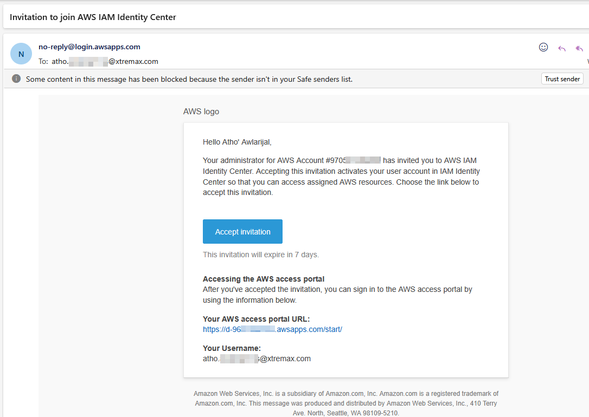
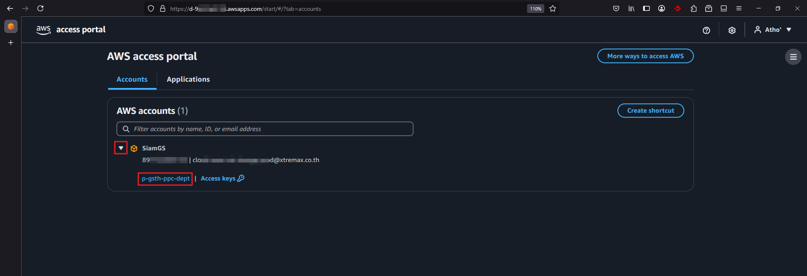
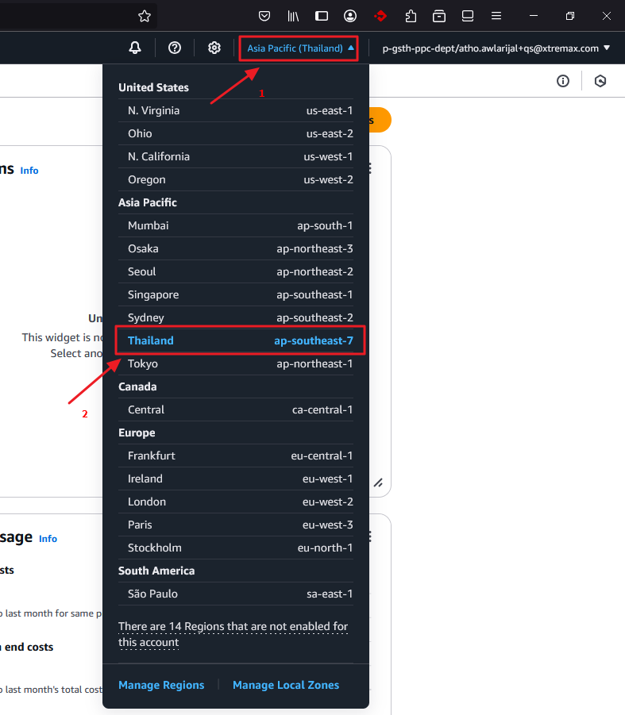
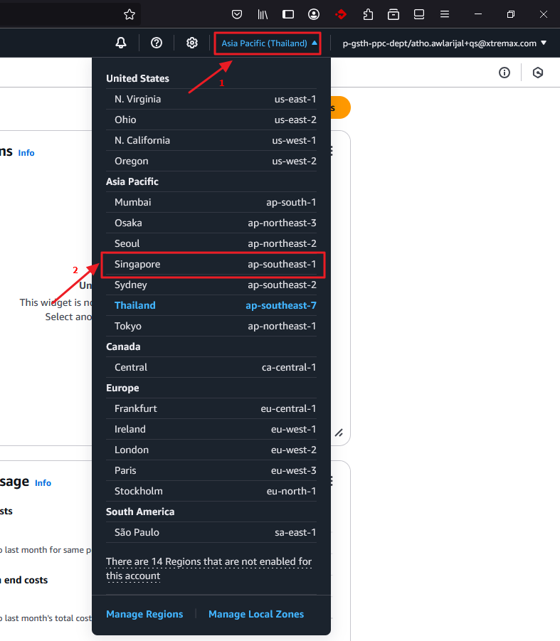
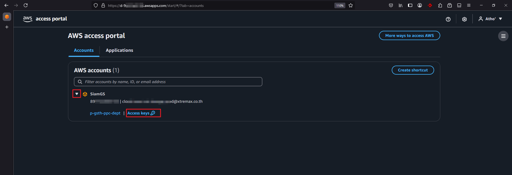
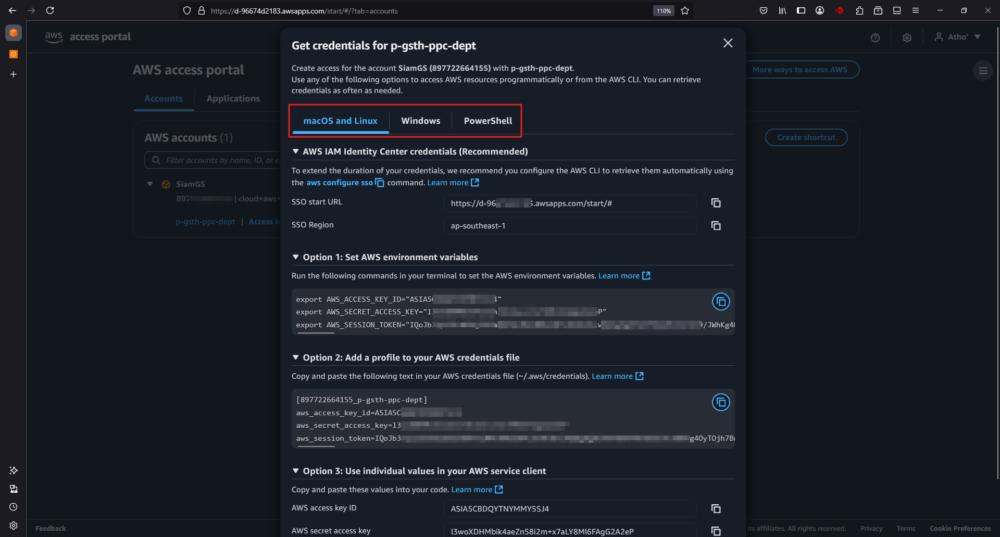

# General Information
The information in this document is confidential to the company to whom it is addressed and should be used for that purpose only. It may not be reproduced in whole, or in part, nor may any of the information contained therein be disclosed for any purpose outside the addressee's company without the prior written consent of Xtremax (Thailand) Co., Ltd..  The addressee's company shall have the right to duplicate and use the data for its own internal evaluation. A recipient may not solicit, directly or indirectly (whether through an agent or otherwise) the participation of another institution or person without the prior approval of the directors of Xtremax (Thailand) Co., Ltd

## 1.1 Introduction

This document is used as a reference to access and use the AWS feature related to the migration project. When interacting with AWS, AWS security credentials are specified to verify identity and determine permissions for accessing requested resources. These credentials are used to authenticate and authorize the requests.

## 1.2 AWS Console Login

### 1.2.1 Login Using IAM Identity Center

To access the system in AWS, users need to log in to the AWS console by following these steps:

#### Step 1: First-time Setup

1. **Check your email** and click on the **Accept invitation** link
2. This will take you to the **New user sign up** page where you can set your password

> **Important:** The email includes your username and AWS access portal URL. Record this information for future login.

#### Step 2: Sign In

1. After setting your password, go to the **Sign in** page
2. Enter your username and password, then choose **Sign in**

#### Step 3: Access Portal Navigation

The AWS access portal will open and display the organization and applications you can access:

- Expand the **Organization** to see a list of AWS accounts
- Select the desired account to view roles that allow access to AWS resources

Each permission set has two access methods:

- **Role** (e.g., `p-gsth-ppc-dept`): Opens the AWS Console Home
- **Access keys**: Provides credentials for AWS CLI or SDK. Supports both short-term credentials that auto-refresh and manually refreshed access keys

#### Step 4: Access AWS Console

1. Click the **Role** link to sign in to the AWS Console Home
2. Once logged in, ensure the region is set to **Thailand (ap-southeast-7)**

### 1.2.2 Change Region in AWS Console

To change regions in the AWS Console:

1. Click the current region on the top-right menu bar
2. Select your desired region (e.g., **Singapore (ap-southeast-1)**)

---

## 1.3 Get IAM Identity Center User Credentials for AWS CLI or SDK

The AWS access portal provides IAM Identity Center users with SSO access to AWS accounts and cloud applications. After signing in, temporary credentials can be retrieved for CLI or SDK usage.

:::tip
**Note:**  IAM Identity Center users differ from IAM users. IAM users use long-term credentials, while IAM Identity Center users get temporary credentials—recommended as a security best practice.
:::

### 1.3.1 Automatic Credential Refresh (Recommended)

To get auto-refreshing credentials:

#### Step 1: Access Portal Sign In

1. Sign in to the AWS access portal using the URL from the email

#### Step 2: Navigate to Accounts

1. Go to the **Accounts** tab and find the required AWS account
2. Account name, ID, and email will be shown

#### Step 3: Select Permission Set

1. Under the account, locate the assigned permission set (e.g., `p-gsth-ppc-dept`)
2. Choose **Access keys** or **Command line or programmatic access**

#### Step 4: Configure Credentials

1. In the **Get credentials** dialog, select your OS: **macOS/Linux**, **Windows**, or **PowerShell**
2. Look for the following details under **IAM Identity Center credentials (Recommended)**:
   - **SSO Start URL**
   - **SSO Region**

These are required to configure an IAM Identity Center profile and `sso-session` for AWS CLI.

### 1.3.2 Manual Credential Refresh

To get credentials with manual refresh:

#### Step 1: Access Portal Sign In

1. Sign in to the AWS access portal using the URL from the email

#### Step 2: Navigate to Accounts

1. Go to the **Accounts** tab, locate the required account, and expand it
2. Select **Access keys** or **Command line or programmatic access**

#### Step 3: Get Credentials

1. In the **Get credentials** dialog, choose your OS platform

#### Step 4: Choose Credential Method

Choose from the following credential methods:

##### Option 1: Set AWS Environment Variables
- Overrides all existing credential settings
- Copy the commands and paste them in the CLI terminal

##### Option 2: Add a Profile to Your AWS Credentials File
- Allows using multiple credential sets
- Copy the commands to your credentials file and use `--profile` in AWS CLI commands

##### Option 3: Use Individual Values in Your AWS Service Client
- Ideal for using SDKs
- Copy values and assign them to the appropriate variables in your code
