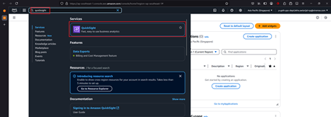
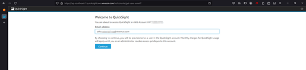
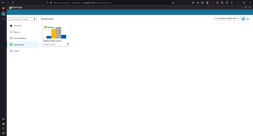
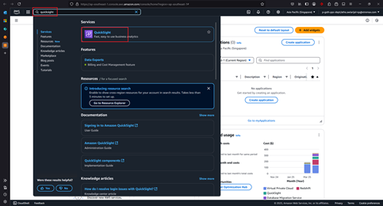
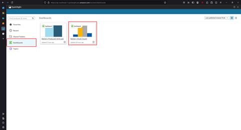
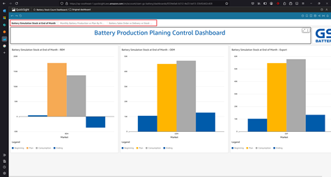

# 5. QuickSight

Since QuickSight is not available yet in the Thailand region, please change the region to Singapore region.

## 5.1. Sign up QuickSight

### Step 1: Access QuickSight
Access QuickSight by searching "quicksight" in the search bar.

### Step 2: Fill Your Email
Fill your email address to begin the sign-up process.

### Step 3: First Time Access
This is the QuickSight page for the first time access.

## 5.2. Access Dashboard

### Step 1: Navigate to QuickSight
After signing up to QuickSight, go to QuickSight by searching in the search bar.

### Step 2: Select Dashboard
Click **Dashboards** on the left menu, then choose the dashboard you want to view.

### Step 3: Navigate Dashboard
After choosing the dashboard, navigate by clicking the page.

### Step 4: Dashboard Details
Details of every dashboard may be different based on requirements.

---

## Important Notes

- **Region Requirement**: QuickSight is not available in the Thailand region
- **Alternative Region**: Use Singapore region for QuickSight access
- **First Time Setup**: Complete the initial sign-up process before accessing dashboards
- **Navigation**: Use the left sidebar menu to access different QuickSight features
- **Dashboard Variations**: Each dashboard may have different layouts and features based on specific requirements

