# Redshift

## 6.1. Connect Redshift via DB Client

### Prerequisites

- **DB client** (e.g., DBeaver)
- **Network access** to office network

### Steps

1. **Open DB client** (in this example, DBeaver).

2. **Create a new connection**: Search for "Redshift" then click **Next**.

   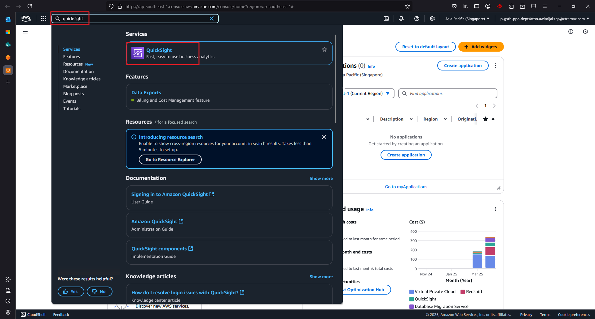

3. **Fill in the connection details**:
   - URL
   - Username  
   - Password
   
   > **Note:** Redshift credentials will be shared separately.

   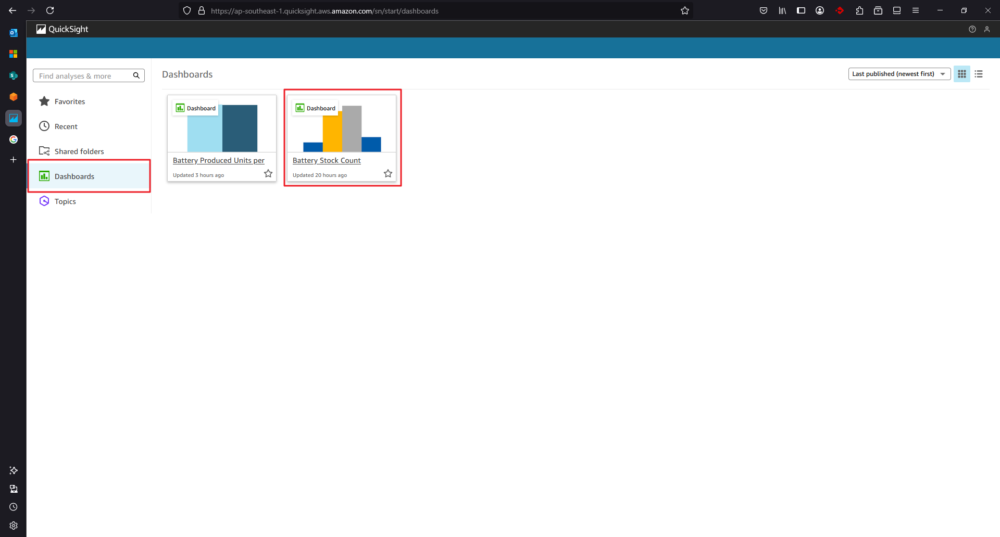

4. **Test the connection** by clicking the **Test Connection** button.

   > **Note:** For the first time, DBeaver needs to install the Redshift driver. Click **Download** when prompted.

   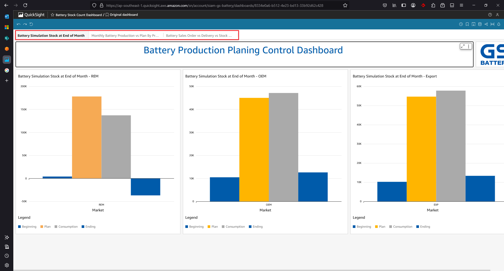

5. **Verify successful connection** - A popup will appear confirming the connection is successful.

   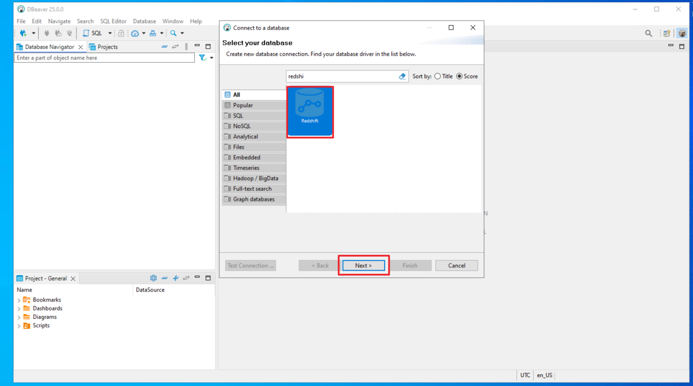

6. Click **OK** then click **Finish**.

7. **View the connected database** - You will see the page after successfully connecting to Redshift.

   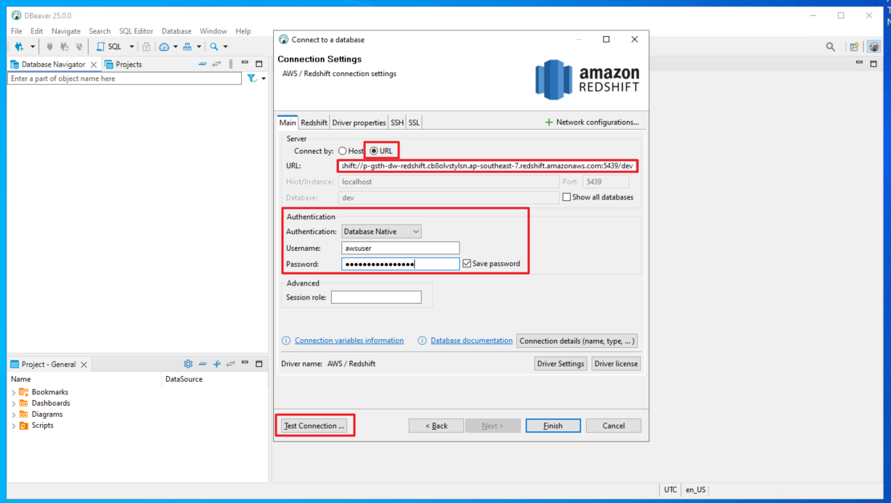

---

### Troubleshooting: Database Visibility

If the database is not showing or only showing the `dev` database:

1. **Right-click on the connection**, then click **Edit Connection**.

   

2. **Check the "Show all databases" checkbox**, then click **OK**. 
   
   When prompted to reconnect, click **Yes**.

   

---

8. **Run queries** to test your connection.

   

---

## 6.2. Connect Redshift via AWS Console

### Steps

1. **Access AWS Console** and navigate to Redshift.

   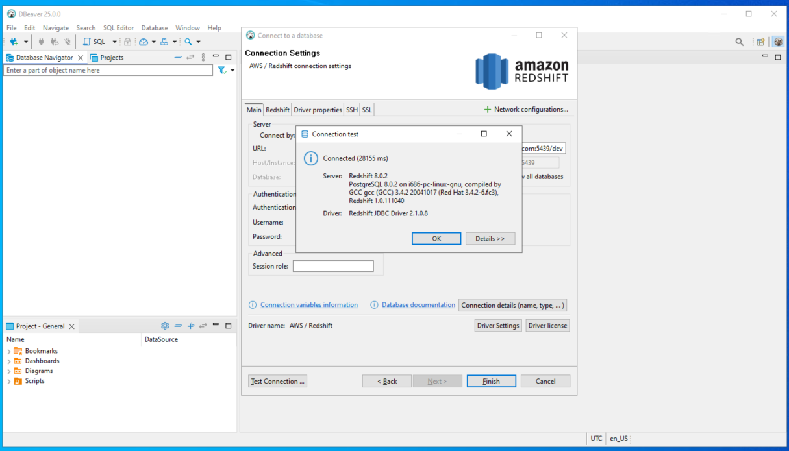

2. **Expand the Redshift menu** by clicking the expand button on the upper left.

   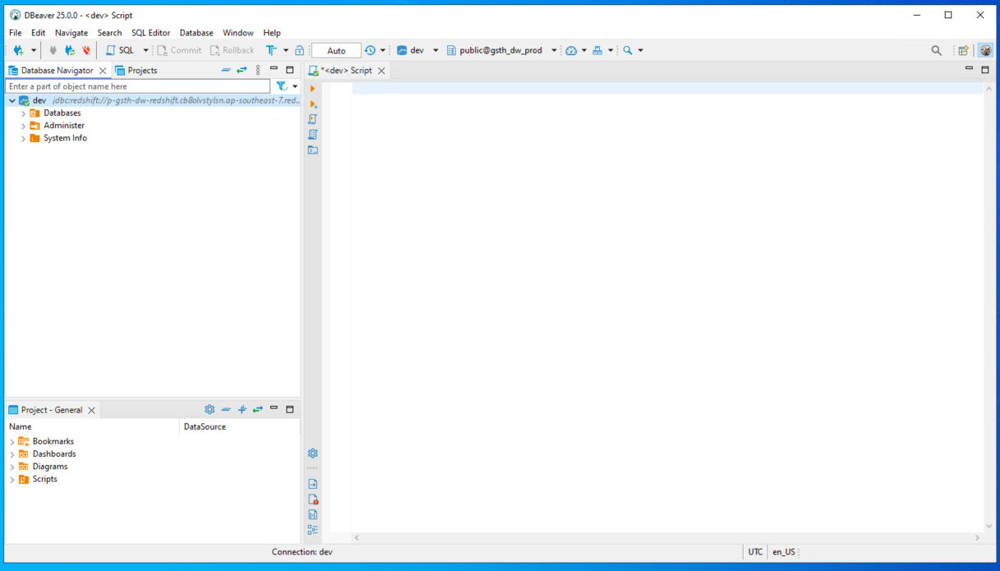

3. **Open Query Editor v2** by clicking on it.

   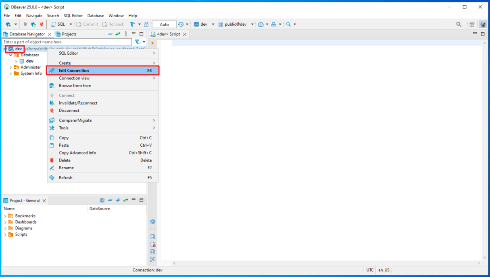

4. **Expand the query editor** interface.

   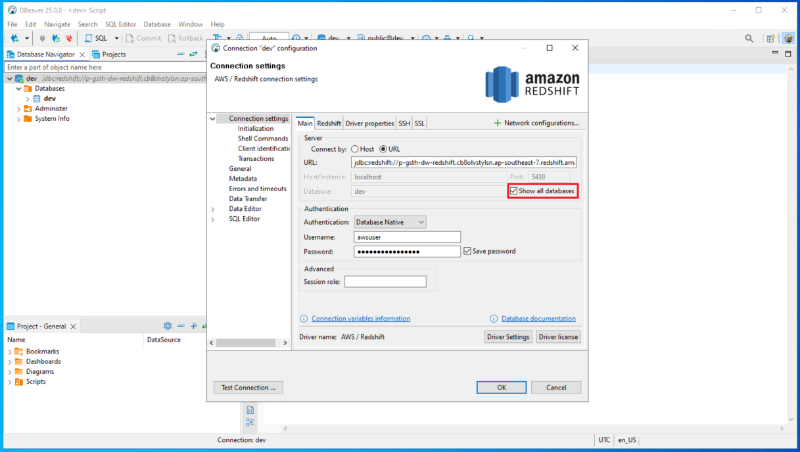

5. **Create a connection** by filling in:
   - Database name
   - Username
   - Password
   
   Then click the **Create connection** button.

   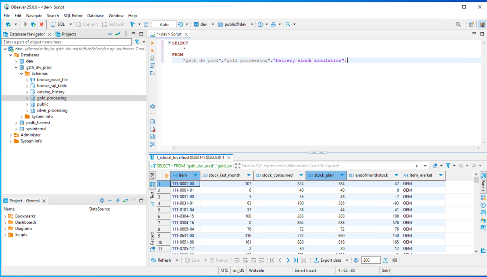

6. **Select database** - After successfully logging in, you can choose the database by expanding the menu on the left.

   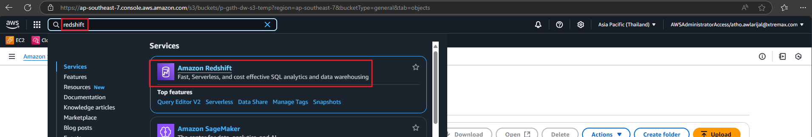

7. **Execute queries** - Write your query and click the **Run** button.

   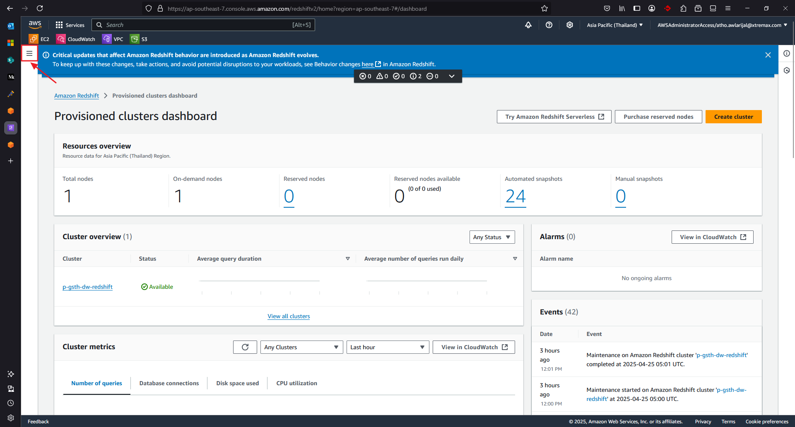
