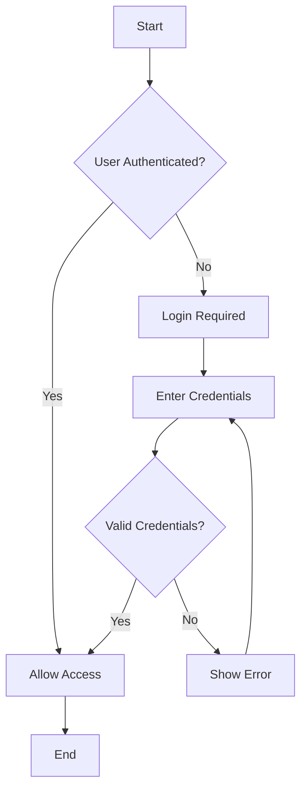
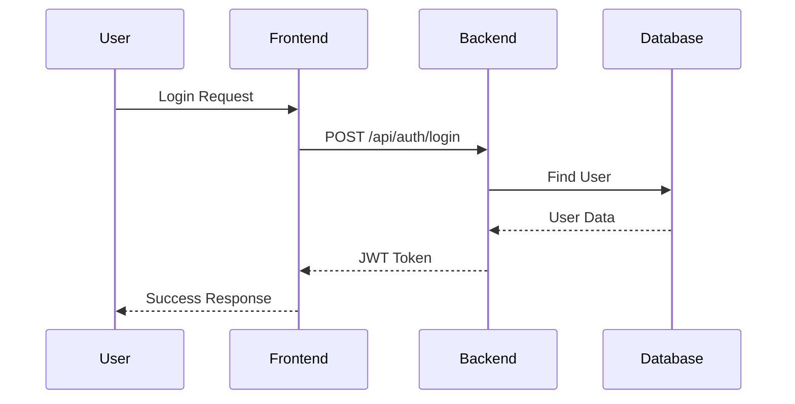

# Advanced Features

Elevate your documentation with advanced Markdown features, interactive elements, and customization techniques

## Interactive Elements

### Collapsible Sections

<details>
<summary>📋 Click to view details - Advanced Settings</summary>

This content is hidden by default and can be expanded by clicking

```bash
# Advanced configuration options
npm run build:prod
npm run test:coverage
npm run deploy:staging
```

**Additional Notes:**
- This configuration is for advanced users only
- Make sure you understand the impact before proceeding
- Always test in a staging environment

</details>

### Tabs and Tab Groups

import Tabs from '@theme/Tabs';
import TabItem from '@theme/TabItem';

<Tabs>
<TabItem value="installation" label="Installation" default={true}>

```bash
npm install my-package
```

This is the standard installation method

</TabItem>
<TabItem value="yarn" label="Yarn">

```bash
yarn add my-package
```

Alternative installation using Yarn

</TabItem>
<TabItem value="manual" label="Manual Install">

Download the package and extract to your project directory

</TabItem>
</Tabs>

## Advanced Notifications

### Custom Styled Notifications

<div style={{
  backgroundColor: '#e3f2fd',
  border: '1px solid #2196f3',
  borderRadius: '8px',
  padding: '16px',
  margin: '16px 0',
  borderLeft: '4px solid #2196f3'
}}>

**💡 Tip**
This is a custom styled notification with a blue theme. You can create notifications with any color scheme you prefer.

</div>

### Success Notification

<div style={{
  backgroundColor: '#e8f5e8',
  border: '1px solid #4caf50',
  borderRadius: '8px',
  padding: '16px',
  margin: '16px 0',
  borderLeft: '4px solid #4caf50'
}}>

**✅ Success!**
Your settings have been applied successfully. The system is ready to use.

</div>

### Error Notification

<div style={{
  backgroundColor: '#ffebee',
  border: '1px solid #f44336',
  borderRadius: '8px',
  padding: '16px',
  margin: '16px 0',
  borderLeft: '4px solid #f44336'
}}>

**❌ Error Found**
An issue occurred with your configuration. Please check the error logs and try again.

</div>

## Advanced Tables

### Complex Data Tables

| Feature | Status | Priority | Effort | Assignee | Due Date |
|---------|--------|----------|--------|----------|----------|
| User Authentication | <span style={{ color: '#4caf50' }}>✅ Complete</span> | High | 40 hrs | Alex Kim | 2024-02-15 |
| Payment Integration | <span style={{ color: '#ff9800' }}>🔄 In Progress</span> | High | 60 hrs | Maria Garcia | 2024-03-01 |
| Email Notifications | <span style={{ color: '#2196f3' }}>⏳ Pending</span> | Medium | 30 hrs | David Lee | 2024-03-15 |
| Analytics Dashboard | <span style={{ color: '#9e9e9e' }}>❌ Not Started</span> | Low | 50 hrs | Tom Wilson | 2024-04-01 |

### Progress Tracking Table

| Phase | Progress | Status | Notes |
|-----------|----------|--------|-------|
| **Phase 1: Foundation** | <div style={{ background: '#e0e0e0', borderRadius: '10px', height: '20px', width: '100%' }}><div style={{ background: '#4caf50', borderRadius: '10px', height: '20px', width: '100%', textAlign: 'center', color: 'white', fontSize: '12px', lineHeight: '20px' }}>100%</div></div> | ✅ Complete | All foundation work completed on time |
| **Phase 2: Core Features** | <div style={{ background: '#e0e0e0', borderRadius: '10px', height: '20px', width: '100%' }}><div style={{ background: '#ff9800', borderRadius: '10px', height: '20px', width: '75%', textAlign: 'center', color: 'white', fontSize: '12px', lineHeight: '20px' }}>75%</div></div> | 🔄 In Progress | Core features 75% complete |
| **Phase 3: Advanced Features** | <div style={{ background: '#e0e0e0', borderRadius: '10px', height: '20px', width: '100%' }}><div style={{ background: '#2196f3', borderRadius: '10px', height: '20px', width: '25%', textAlign: 'center', color: 'white', fontSize: '12px', lineHeight: '20px' }}>25%</div></div> | ⏳ Pending | Just started advanced features |
| **Phase 4: Testing & Deployment** | <div style={{ background: '#e0e0e0', borderRadius: '10px', height: '20px', width: '100%' }}><div style={{ background: '#9e9e9e', borderRadius: '10px', height: '20px', width: '0%', textAlign: 'center', color: 'white', fontSize: '12px', lineHeight: '20px' }}>0%</div></div> | ❌ Not Started | Waiting for development to complete |

## Code Blocks with Advanced Features

### Syntax Highlighting with Line Numbers

```javascript:src/components/UserProfile.js
// User Profile Component
import React, { useState, useEffect } from 'react';

const UserProfile = ({ userId }) => {
  const [user, setUser] = useState(null);
  const [loading, setLoading] = useState(true);

  useEffect(() => {
    fetchUserData(userId);
  }, [userId]);

  const fetchUserData = async (id) => {
    try {
      const response = await fetch(`/api/users/${id}`);
      const userData = await response.json();
      setUser(userData);
    } catch (error) {
      console.error('Error fetching user:', error);
    } finally {
      setLoading(false);
    }
  };

  if (loading) return <div>Loading...</div>;
  if (!user) return <div>User not found</div>;

  return (
    <div className="user-profile">
      <h2>{user.name}</h2>
      <p>{user.email}</p>
    </div>
  );
};

export default UserProfile;
```

### Inline Code with Styling

Use `<span style={{ color: '#e83e8c', fontWeight: 'bold' }}>npm install</span>` to install dependencies

Run `<span style={{ color: '#007bff', fontWeight: 'bold' }}>npm start</span>` to start the development server

## Advanced Lists

### Multi-level Task Lists

```markdown
- [x] Project Setup
  - [x] Create Git repository
  - [x] Set up development environment
  - [x] Configure linting and formatting
  - [x] Create project structure
- [ ] Frontend Development
  - [x] Set up React application
  - [x] Create basic components
  - [ ] Implement user authentication
  - [ ] Create product catalog
  - [ ] Build shopping cart
- [ ] Backend Development
  - [x] Set up Node.js server
  - [x] Configure database
  - [ ] Create API endpoints
  - [ ] Implement authentication
  - [ ] Add payment integration
- [ ] Testing and Deployment
  - [ ] Write unit tests
  - [ ] Perform integration testing
  - [ ] Set up CI/CD pipeline
  - [ ] Deploy to production
```

### Definition Lists

```markdown
**API Endpoint**
: A specific URL that receives HTTP requests and returns responses

**Authentication**
: The process of verifying a user's identity

**Authorization**
: The process of determining what a user can access

**Middleware**
: Software that runs between requests and responses
```

## Advanced Links and References

### Internal References

```markdown
[See installation guide](#installation)
[Check troubleshooting section](#troubleshooting)
[View API documentation](./api-docs)
```

### External Links with Icons

```markdown
[📚 Official Documentation](https://docs.example.com)
[🐛 Report Issues](https://github.com/example/repo/issues)
[💬 Community Forum](https://community.example.com)
[📖 API Reference](https://api.example.com/docs)
```

## Custom HTML Elements

### Alert Boxes

<div style={{
  backgroundColor: '#fff3cd',
  border: '1px solid #ffeaa7',
  borderRadius: '8px',
  padding: '16px',
  margin: '16px 0',
  position: 'relative'
}}>

<div style={{
  position: 'absolute',
  top: '-10px',
  left: '20px',
  backgroundColor: '#fff3cd',
  padding: '0 8px',
  fontSize: '12px',
  fontWeight: 'bold',
  color: '#856404'
}}>
⚠️ Warning
</div>

<div style={{ marginTop: '10px' }}>
This is a custom alert box with a floating label. Use for important warnings that need special attention.
</div>

</div>

### Data Cards

<div style={{
  display: 'grid',
  gridTemplateColumns: 'repeat(auto-fit, minmax(250px, 1fr))',
  gap: '16px',
  margin: '16px 0'
}}>

<div style={{
  backgroundColor: '#f8f9fa',
  border: '1px solid #dee2e6',
  borderRadius: '8px',
  padding: '16px',
  textAlign: 'center'
}}>

<h4 style={{ margin: '0 0 8px 0', color: '#495057' }}>🚀 Performance</h4>
<p style={{ margin: '0', fontSize: '14px', color: '#6c757d' }}>Optimized for speed and efficiency</p>

</div>

<div style={{
  backgroundColor: '#f8f9fa',
  border: '1px solid #dee2e6',
  borderRadius: '8px',
  padding: '16px',
  textAlign: 'center'
}}>

<h4 style={{ margin: '0 0 8px 0', color: '#495057' }}>🔒 Security</h4>
<p style={{ margin: '0', fontSize: '14px', color: '#6c757d' }}>Built with best security practices</p>

</div>

<div style={{
  backgroundColor: '#f8f9fa',
  border: '1px solid #dee2e6',
  borderRadius: '8px',
  padding: '16px',
  textAlign: 'center'
}}>

<h4 style={{ margin: '0 0 8px 0', color: '#495057' }}>📱 Responsive</h4>
<p style={{ margin: '0', fontSize: '14px', color: '#6c757d' }}>Works on all devices and screen sizes</p>

</div>

</div>

## Mathematical Expressions

### Inline Math

Quadratic formula: `x = (-b ± √(b² - 4ac)) / 2a`

### Math Block

```
E = mc²
```

Where:
- E = Energy
- m = Mass
- c = Speed of light

## Advanced Diagrams

### Flowchart



### Sequence Diagram



### Class Diagram

```mermaid
classDiagram
    class User {
        +String id
        +String email
        +String name
        +login()
        +logout()
    }
    
    class Product {
        +String id
        +String name
        +Number price
        +addToCart()
        +removeFromCart()
    }
    
    class Order {
        +String id
        +Date createdAt
        +Number total
        +process()
        +cancel()
    }
    
    User ||--o{ Order : places
    Order ||--o{ Product : contains
```

## Custom CSS Styling

### Styled Code Blocks

<div style={{
  backgroundColor: '#2d3748',
  color: '#e2e8f0',
  padding: '16px',
  borderRadius: '8px',
  fontFamily: 'monospace',
  fontSize: '14px',
  lineHeight: '1.5',
  overflow: 'auto'
}}>

```bash
# Custom styled code block
npm install --save-dev @types/node
npm run build:production
npm run deploy:staging
```

</div>

### Gradient Background

<div style={{
  background: 'linear-gradient(135deg, #667eea 0%, #764ba2 100%)',
  color: 'white',
  padding: '24px',
  borderRadius: '12px',
  textAlign: 'center',
  margin: '16px 0'
}}>

<h3 style={{ margin: '0 0 16px 0' }}>🎉 Congratulations!</h3>
<p style={{ margin: '0', fontSize: '16px' }}>
You have completed the advanced features lesson! You're now ready to create engaging professional documentation.
</p>

</div>

## Best Practices for Advanced Features

### 1. **Performance Considerations**
- Use images and diagrams sparingly
- Optimize custom CSS for mobile devices
- Test interactive elements across different browsers
- Consider loading times for complex diagrams

### 2. **Accessibility**
- Provide alt text for all visual elements
- Check color contrast is sufficient
- Test with screen readers
- Use semantic HTML when possible

### 3. **Maintenance**
- Organize and document custom CSS
- Use consistent naming conventions
- Version control all custom elements
- Test and update regularly

### 4. **User Experience**
- Don't overuse advanced features
- Ensure features enhance readability
- Test on different devices and screen sizes
- Gather user feedback regularly

## Tools and Resources

### Advanced Markdown Editors
- **Typora:** WYSIWYG Markdown editor with live preview
- **Obsidian:** Knowledge base with advanced linking
- **Notion:** Collaborative workspace with rich formatting
- **HackMD:** Real-time collaborative Markdown

### Diagram Creation Tools
- **Mermaid:** Text-based diagram creation
- **Draw.io:** Free online diagram creator
- **Lucidchart:** Professional diagram tool
- **PlantUML:** Text-based UML diagrams

### CSS Frameworks
- **Tailwind CSS:** Utility-first CSS framework
- **Bootstrap:** Popular CSS framework
- **Bulma:** Modern CSS framework
- **Foundation:** Responsive frontend framework

## Next Steps

Now that you've mastered advanced features, you can:

1. **Experiment** - Try combining different features
2. **Customize** - Create your own styles and components
3. **Share** - Contribute to documentation standards
4. **Teach** - Help others learn these techniques

Remember: Advanced features should enhance user experience, not complicate it. Always prioritize clarity and usability over complexity! 