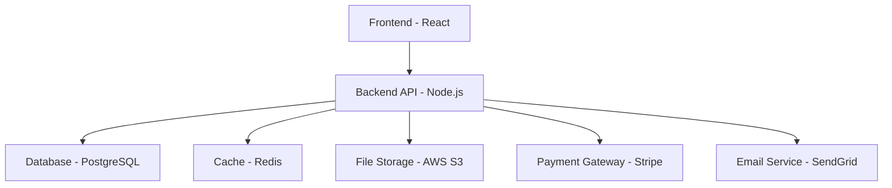

# Project Documentation Guide

Effective project documentation is essential for successful project management, team collaboration, and knowledge transfer. This guide will teach you how to create comprehensive, well-structured project documentation.

## What is Project Documentation?

Project documentation includes all written materials that describe, explain, and guide a project from conception to completion. It serves as:

- **📋 Reference Guide** - For team members and stakeholders
- **📚 Knowledge Base** - For future projects and team onboarding
- **📊 Progress Tracker** - For monitoring project status
- **🔍 Decision Log** - For recording important decisions and rationale
- **📖 Training Material** - For new team members

## Documentation Structure

### 1. **Project Overview**

```markdown
# Project Name

## Project Information

| Field | Value |
|-------|-------|
| **Project Name** | E-Commerce Management System |
| **Project ID** | ECMS-2024-001 |
| **Start Date** | 2024-01-15 |
| **End Date** | 2024-06-30 |
| **Project Manager** | Sarah Johnson |
| **Team Size** | 8 members |
| **Budget** | $150,000 |

## Executive Summary

This project aims to develop a comprehensive e-commerce management system that provides a complete solution for online businesses. The system will include customer-facing features, administrative tools, inventory management, and analytics capabilities.

## Project Vision

To create a scalable, user-friendly, and feature-rich e-commerce platform that enables businesses to sell products online efficiently while providing excellent customer experience and powerful management tools.

## Success Criteria

- [ ] System handles 10,000+ concurrent users
- [ ] 99.9% uptime during peak hours
- [ ] Mobile-responsive design
- [ ] Integration with 3+ payment gateways
- [ ] Real-time inventory management
- [ ] Comprehensive analytics dashboard
```

### 2. **Technical Architecture**

```markdown
## Technical Architecture

### System Overview



### Technology Stack

#### Frontend
- **Framework:** React.js 18+ with TypeScript
- **Styling:** Tailwind CSS
- **State Management:** Redux Toolkit
- **UI Components:** Headless UI + Radix UI
- **Testing:** Jest + React Testing Library

#### Backend
- **Runtime:** Node.js 18+ with TypeScript
- **Framework:** Express.js
- **API:** REST API + GraphQL
- **Authentication:** JWT + OAuth 2.0
- **Real-time:** Socket.io

#### Database
- **Primary:** PostgreSQL 15+
- **Cache:** Redis 7+
- **Search:** Elasticsearch 8+
- **File Storage:** AWS S3

#### DevOps
- **Cloud:** AWS
- **Containerization:** Docker + Kubernetes
- **CI/CD:** GitHub Actions
- **Monitoring:** Prometheus + Grafana
```

### 3. **Requirements Documentation**

```markdown
## Requirements

### Functional Requirements

#### User Management
- **FR-001:** Users can register with email verification
- **FR-002:** Users can login with email/password or OAuth
- **FR-003:** Users can update their profile information
- **FR-004:** Users can reset their password

#### Product Management
- **FR-005:** Admins can create, edit, and delete products
- **FR-006:** Products support multiple images and variants
- **FR-007:** Products can be categorized and tagged
- **FR-008:** Inventory levels are tracked automatically

#### Order Management
- **FR-009:** Customers can add items to shopping cart
- **FR-010:** Customers can checkout with multiple payment methods
- **FR-011:** Orders are tracked with status updates
- **FR-012:** Customers can view order history

### Non-Functional Requirements

#### Performance
- **NFR-001:** Page load time < 2 seconds
- **NFR-002:** System supports 10,000+ concurrent users
- **NFR-003:** Database queries < 100ms average

#### Security
- **NFR-004:** All data transmitted over HTTPS
- **NFR-005:** Passwords encrypted with bcrypt
- **NFR-006:** JWT tokens expire after 24 hours
- **NFR-007:** Input validation on all forms

#### Usability
- **NFR-008:** Mobile-responsive design
- **NFR-009:** WCAG 2.1 AA compliance
- **NFR-010:** Support for multiple languages
```

### 4. **Project Timeline**

```markdown
## Project Timeline

### Phase 1: Foundation (Weeks 1-4)

| Week | Deliverables | Status |
|------|--------------|--------|
| 1 | Project setup, team formation | ✅ Complete |
| 2 | Requirements gathering, architecture design | ✅ Complete |
| 3 | Database design, API specification | 🔄 In Progress |
| 4 | Development environment setup | ⏳ Pending |

### Phase 2: Core Development (Weeks 5-12)

| Week | Deliverables | Status |
|------|--------------|--------|
| 5-6 | User authentication system | ⏳ Pending |
| 7-8 | Product management module | ⏳ Pending |
| 9-10 | Shopping cart and checkout | ⏳ Pending |
| 11-12 | Order management system | ⏳ Pending |

### Phase 3: Advanced Features (Weeks 13-16)

| Week | Deliverables | Status |
|------|--------------|--------|
| 13 | Payment integration | ⏳ Pending |
| 14 | Analytics and reporting | ⏳ Pending |
| 15 | Email notifications | ⏳ Pending |
| 16 | Mobile app development | ⏳ Pending |

### Phase 4: Testing & Deployment (Weeks 17-20)

| Week | Deliverables | Status |
|------|--------------|--------|
| 17 | Comprehensive testing | ⏳ Pending |
| 18 | Performance optimization | ⏳ Pending |
| 19 | Production deployment | ⏳ Pending |
| 20 | Documentation and training | ⏳ Pending |
```

### 5. **Team Structure**

```markdown
## Team Structure

### Project Leadership

| Role | Name | Contact | Responsibilities |
|------|------|---------|------------------|
| **Project Manager** | Sarah Johnson | sarah@company.com | Overall project coordination |
| **Technical Lead** | Mike Chen | mike@company.com | Technical decisions, code review |
| **Product Owner** | Lisa Wang | lisa@company.com | Requirements, user stories |

### Development Team

| Role | Name | Contact | Focus Areas |
|------|------|---------|-------------|
| **Frontend Developer** | Alex Kim | alex@company.com | React, UI/UX |
| **Frontend Developer** | Maria Garcia | maria@company.com | React, Testing |
| **Backend Developer** | David Lee | david@company.com | Node.js, API |
| **Backend Developer** | Tom Wilson | tom@company.com | Database, Security |
| **DevOps Engineer** | Rachel Brown | rachel@company.com | Infrastructure, CI/CD |
| **QA Engineer** | Chris Davis | chris@company.com | Testing, Quality Assurance |

### Stakeholders

| Role | Name | Contact | Involvement |
|------|------|---------|-------------|
| **Executive Sponsor** | John Smith | john@company.com | Budget approval, strategic direction |
| **Business Analyst** | Emma Taylor | emma@company.com | Business requirements, user stories |
| **UX Designer** | Sam Johnson | sam@company.com | User experience, wireframes |
```

### 6. **Risk Management**

```markdown
## Risk Management

### Identified Risks

| Risk ID | Risk Description | Probability | Impact | Mitigation Strategy |
|---------|------------------|-------------|--------|-------------------|
| **R-001** | Key team member leaves | Medium | High | Cross-training, documentation |
| **R-002** | Technology stack changes | Low | Medium | Research alternatives early |
| **R-003** | Scope creep | High | Medium | Regular scope reviews |
| **R-004** | Integration delays | Medium | High | Early integration testing |
| **R-005** | Performance issues | Medium | High | Performance testing throughout |

### Risk Response Plan

#### High Priority Risks

:::warning
**R-001: Key Team Member Departure**
- **Mitigation:** Document all critical processes
- **Contingency:** Identify backup resources
- **Monitoring:** Regular knowledge sharing sessions
:::

:::danger
**R-004: Integration Delays**
- **Mitigation:** Start integration testing early
- **Contingency:** Have fallback integration options
- **Monitoring:** Weekly integration status reviews
:::
```

### 7. **Communication Plan**

```markdown
## Communication Plan

### Meeting Schedule

| Meeting Type | Frequency | Participants | Purpose |
|--------------|-----------|--------------|---------|
| **Daily Standup** | Daily (9:00 AM) | Development Team | Progress updates, blockers |
| **Sprint Planning** | Every 2 weeks | Full Team | Sprint planning, task assignment |
| **Sprint Review** | Every 2 weeks | Full Team + Stakeholders | Demo, feedback |
| **Sprint Retrospective** | Every 2 weeks | Development Team | Process improvement |
| **Stakeholder Update** | Monthly | Leadership + Stakeholders | High-level progress |

### Communication Channels

- **Slack:** Daily communication, quick questions
- **Email:** Formal communications, decisions
- **Jira:** Task tracking, issue management
- **Confluence:** Documentation, meeting notes
- **GitHub:** Code reviews, technical discussions
```

### 8. **Quality Assurance**

```markdown
## Quality Assurance

### Testing Strategy

#### Unit Testing
- **Coverage Target:** 80% code coverage
- **Tools:** Jest, React Testing Library
- **Responsibility:** Individual developers

#### Integration Testing
- **Coverage Target:** All API endpoints
- **Tools:** Supertest, Postman
- **Responsibility:** Backend team

#### End-to-End Testing
- **Coverage Target:** Critical user flows
- **Tools:** Cypress, Playwright
- **Responsibility:** QA team

#### Performance Testing
- **Coverage Target:** Load testing scenarios
- **Tools:** Artillery, JMeter
- **Responsibility:** DevOps team

### Code Quality Standards

- **Linting:** ESLint, Prettier
- **Code Review:** Required for all changes
- **Documentation:** Inline comments, README files
- **Security:** Regular security scans
```

## Documentation Templates

### Template 1: Project Charter

```markdown
# Project Charter: [Project Name]

## Project Information
- **Project Name:** [Name]
- **Project ID:** [ID]
- **Start Date:** [Date]
- **End Date:** [Date]
- **Project Manager:** [Name]

## Project Overview
[Brief description of the project]

## Business Case
[Why this project is needed]

## Project Objectives
- [Objective 1]
- [Objective 2]
- [Objective 3]

## Success Criteria
- [Criterion 1]
- [Criterion 2]
- [Criterion 3]

## Key Stakeholders
- [Stakeholder 1]
- [Stakeholder 2]

## Budget
[Budget information]

## Risks and Assumptions
- [Risk/Assumption 1]
- [Risk/Assumption 2]
```

### Template 2: Technical Specification

```markdown
# Technical Specification: [Feature/Component]

## Overview
[Description of the feature or component]

## Requirements
### Functional Requirements
- [Requirement 1]
- [Requirement 2]

### Non-Functional Requirements
- [Requirement 1]
- [Requirement 2]

## Architecture
[Technical architecture description]

## API Design
[API endpoints and specifications]

## Database Design
[Database schema and relationships]

## Security Considerations
[Security requirements and implementation]

## Testing Strategy
[Testing approach and test cases]

## Deployment
[Deployment requirements and procedures]
```

## Best Practices

### 1. **Documentation Standards**
- Use consistent formatting and structure
- Include version control information
- Regular review and updates
- Clear ownership and responsibilities

### 2. **Content Organization**
- Logical structure and flow
- Easy navigation and search
- Appropriate level of detail
- Visual elements for clarity

### 3. **Collaboration**
- Multiple contributors can edit
- Review and approval process
- Feedback collection and incorporation
- Regular team training on documentation

### 4. **Maintenance**
- Regular updates and reviews
- Version control for all documents
- Archive old versions
- Continuous improvement process

## Tools and Resources

### Documentation Tools
- **Markdown Editors:** VS Code, Typora, Obsidian
- **Collaboration:** Confluence, Notion, Google Docs
- **Version Control:** Git, GitHub, GitLab
- **Diagramming:** Draw.io, Lucidchart, Mermaid

### Project Management Tools
- **Task Management:** Jira, Asana, Trello
- **Communication:** Slack, Microsoft Teams
- **File Sharing:** Google Drive, Dropbox, OneDrive
- **Video Conferencing:** Zoom, Microsoft Teams

## Next Steps

Now that you understand project documentation, you can:

1. **Apply** - Use these templates for your current projects
2. **Customize** - Adapt templates to your organization's needs
3. **Enhance** - Add [Advanced Features](./advanced-features) to your documentation
4. **Train** - Share these practices with your team

Remember: Good project documentation is an investment that pays dividends throughout the project lifecycle and beyond! 